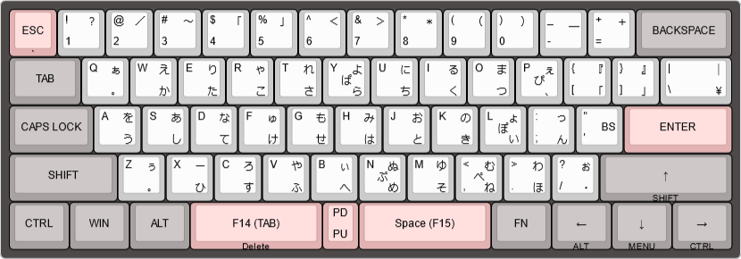

# SKYLOONG GK61 Pro 向け Nicola配列キーマップ

キーボード側で親指シフトをローマ字(※英字キー入力から仮名への変換方式)出力するためのキーマップです。  
物理的なキー配置はANSI配列で、Windowsの設定では日本語/英語キーボード(101/102キー)配列で使用します。  
「」や『』・などは直接出力できませんから、MS-IMEなどの変換機能で確定します。

## 配列

## 情報元
* https://github.com/sadaoikebe/qmk_firmware/ をベースにNicolaを実装しています。
